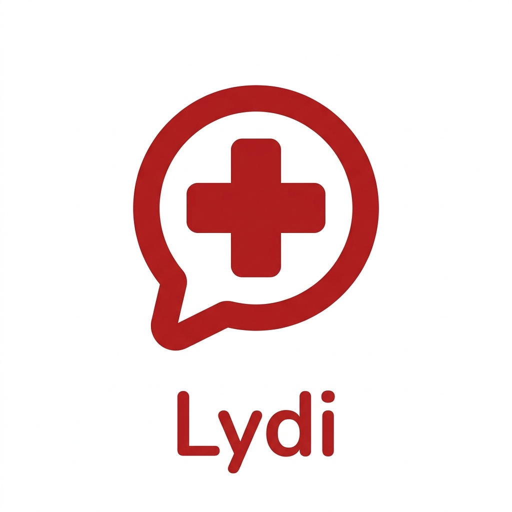

# Lydi | Assistant d'Orientation Clinique

<p align="center">
  
</p>

<p align="center">
  
  
  
  
</p>

## Description
**Lydi** est une solution web intelligente conçue pour accompagner les patients dans leur parcours de soin initial. En utilisant des modèles d'intelligence artificielle avancés, Lydi analyse les symptômes décrits par l'utilisateur pour proposer une orientation clinique pertinente, visualiser des parcours de soins et recommander des spécialités médicales.

L'objectif de Lydi est de réduire l'incertitude des patients avant une consultation, tout en rappelant systématiquement que l'avis d'un professionnel de santé reste indispensable.

## Caractéristiques principales

- **Chat Clinique Intelligent** : Une interface de discussion fluide avec un assistant IA spécialisé dans l'orientation médicale.
- **Cartes d'Orientation Dynamiques** : Génération automatique de schémas (Flowcharts, Mindmaps, Arbres de décision) pour visualiser les étapes de soin possibles.
- **Filtrage Clinique Avancé** : Système intelligent capable de distinguer les symptômes des échanges sociaux pour une précision accrue.
- **Design Premium & Adaptatif** : Interface moderne avec support complet du mode sombre et du mode clair.
- **Sécurité & Éthique** : Disclaimer médical bilingue intégré pour garantir une utilisation responsable de l'information.

## Stack Technique

- **Frontend** : React 18, TypeScript, Vite.
- **Styling** : Vanilla CSS / SCSS (Focus sur l'esthétique premium).
- **Visualisation** : Mermaid.js (Diagrammes dynamiques).
- **API** : Gradio Client (Communication avec le backend IA sur Hugging Face).
- **Icons** : Lucide React.

## Installation et Démarrage

1. **Cloner le projet** :
   ```bash
   git clone <repository-url>
   cd clinical-orientation-frontend
   ```

2. **Installer les dépendances** :
   ```bash
   npm install
   ```

3. **Configurer les variables d'environnement** :
   Créez un fichier `.env` à la racine et ajoutez votre token Hugging Face :
   ```env
   VITE_HF_TOKEN=votre_token_hugging_face
   ```

4. **Lancer en mode développement** :
   ```bash
   npm run dev
   ```

## Disclaimer Médical
Lydi est un outil d'orientation et non de diagnostic. Les informations fournies ne remplacent en aucun cas l'avis, le diagnostic ou le traitement d'un professionnel de la santé qualifié.
